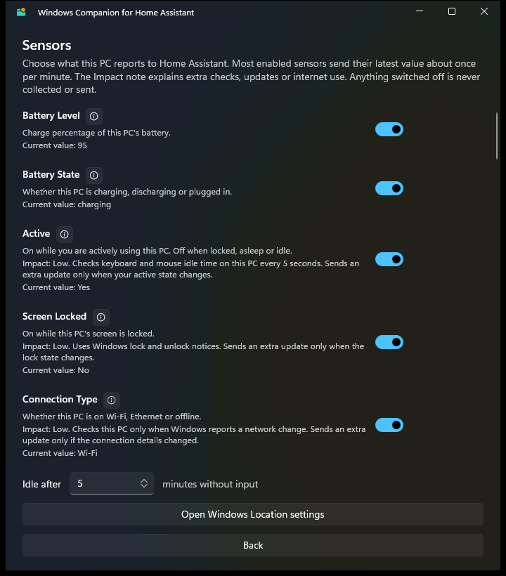

<p align="center">
  
</p>

<h1 align="center">Windows Companion for Home Assistant</h1>

<p align="center">
  A lean, native Windows companion for
  <a href="https://www.home-assistant.io/">Home Assistant</a> — the Windows
  counterpart to the official
  <a href="https://github.com/home-assistant/iOS">iOS/macOS app</a>.
</p>

> [!NOTE]
> An independent project. Not affiliated with, endorsed by, or sponsored by the Open
> Home Foundation, Nabu Casa, or the Home Assistant project. "Home Assistant" is a
> trademark of the Open Home Foundation. "Windows" is a trademark of the Microsoft
> group of companies.

It is **not** a dashboard. It stays out of your way in the system tray, reports your
PC's status to Home Assistant, turns Home Assistant notifications into native Windows
toasts, and opens Home Assistant in your normal browser when you want the UI.

## Why this project exists

Windows is the one major platform without a first-party Home Assistant companion.
There are good third-party options, but they generally ask you to run extra
infrastructure or install a custom integration. The goals here are deliberately
narrow:

- **Lightweight.** A tray app that does a few things well. No embedded browser, no
  media player, no command runner. If you want the Home Assistant UI, it opens the
  one you already have.
- **Native.** WinUI 3 / Windows App SDK, so it looks and behaves like a Windows app -
  Fluent styling, Mica, native toasts, a real tray icon.
- **App push like macOS/iOS.** Notifications arrive over the same
  `mobile_app` local push channel the official Apple apps use, so the PC shows up as
  a normal notify target in Home Assistant. No MQTT broker, no custom component.
- **Battle tested.** An explicit goal rather than a claim: spec-driven development,
  a platform-agnostic core covered by unit tests, protocol behaviour verified against
  Home Assistant's own source, and decisions recorded in
  [`specs/`](specs/) so the reasoning survives.

Concretely, that means it talks to the **built-in `mobile_app` integration** - the
same one the official companion apps use. Nothing to install on the Home Assistant
side.

### How it compares

[HASS.Agent](https://github.com/LAB02-Research/HASS.Agent) is the established
Windows companion and is far more capable than this project. If you want commands,
quick actions, a media player or a large sensor catalogue today, use it. This table
is about *fit*, not quality.

| | This project | HASS.Agent |
| --- | --- | --- |
| Home Assistant side | Built-in `mobile_app` integration | Custom [HASS.Agent integration](https://github.com/LAB02-Research/HASS.Agent-Integration) (HACS) |
| Extra infrastructure | None | MQTT broker |
| Notifications | `mobile_app` local push, same as the macOS/iOS apps | MQTT + custom integration; supports images and actionable buttons |
| Sign-in | OAuth2 in your browser, no token to paste | Long-lived token + MQTT credentials |
| UI framework | WinUI 3 (Windows App SDK), .NET 9 | WinForms + Syncfusion, .NET 6 |
| Home Assistant UI | Opens your default browser | Built-in WebView |
| Sensors | Small, curated, opt-in per sensor | ~37 built in |
| Commands / media player / quick actions | Not offered | Yes |
| Runs when logged out | No | Yes, via satellite service |
| Maturity | Early; MVP | Mature, large community |

The short version: **HASS.Agent is the featureful option; this aims to be the boring
one that just works with stock Home Assistant.**

## Features (MVP)

- **Browser-based sign-in** — OAuth2 (IndieAuth) with a loopback redirect. No
  long-lived tokens to create or paste. The refresh token is stored in the Windows
  Credential Locker.
- **Internal and external URLs** — store the address you use at home and the one
  you use away, and let the app pick. See
  [Connecting from home and away](#connecting-from-home-and-away).
- **Tray-resident** — closing the window hides it to the notification area. The tray
  tooltip shows current health. The status overview can register the app to start
  in the tray when the current Windows user signs in.
- **Windows toasts** — notifications sent to this PC from Home Assistant appear as
  native toasts, delivered over the `mobile_app` local push channel (Windows has no
  APNS/FCM equivalent).
- **Opt-in sensor catalog** — battery, active/idle, screen locked, connection type,
  IPv4/IPv6 address, LAN MAC address, Wi-Fi SSID/BSSID, OS version, PC model, last
  boot, display count and resolution, dark mode, locale and time zone, system-drive
  usage, notification/presentation state, microphone and camera use, audio output,
  headset presence, WinGet update count, system lifecycle state, and an optional
  frontmost-app/last-update value. Each sensor can be switched on or off
  individually, shows a local preview, and privacy-sensitive ones are off by
  default. Network identifiers are only read once you enable their own sensor —
  the preview shows nothing beforehand — and the IPv4, IPv6 and MAC readings all
  describe the adapter carrying the active route rather than a VPN or Hyper-V
  adapter.
- **Lifecycle signals** — sleep, sign-out and shutdown are detected without polling
  and pushed as an opt-in `system_state` sensor with a short, strictly bounded final
  attempt. Windows may terminate the app first, so anything undelivered is recorded
  locally and reported after the next successful connection. The companion never
  blocks or delays a shutdown. The sensor is off by default and asks you to confirm
  its limits before it starts, because they cannot be engineered away — see
  [docs/windows-lifecycle-signals.md](docs/windows-lifecycle-signals.md).
- **Demo mode** — try the app without a server. From the sign-in screen, "Explore in
  demo mode" opens the sensor catalog with each sensor's current value read on this
  PC. Nothing is registered, saved or sent to Home Assistant, no sensor source is
  started, and a warning banner stays on every screen until you leave the demo.
- **Health and logs** — a health verdict based on whether the app is actually
  reporting on schedule, plus a rolling local log you can open from the UI.
- **Open Home Assistant** — one click (window or tray menu) to open your instance in
  the default browser.

### The sensor catalog

Every sensor is opt-in, explains what it costs to run, and shows its current value
locally before anything is sent. Switching one off means it is not collected at all,
not merely filtered out.

<p align="center">
  
</p>

## Requirements

- Windows 10 (build 19041+) or Windows 11
- [.NET 9 Desktop Runtime](https://dotnet.microsoft.com/download/dotnet/9.0) to run
- [.NET 9 SDK](https://dotnet.microsoft.com/download) to build from source
- **Windows App Runtime 2.3** — the app ships unpackaged and uses the Windows App SDK
  bootstrapper. Without it the app exits at startup with `REGDB_E_CLASSNOTREG`. The
  MSIX packages ship inside the `Microsoft.WindowsAppSDK.Runtime` NuGet package under
  `tools/MSIX/win10-x64/` and can be installed with `Add-AppxPackage`.
- A Home Assistant instance with the `mobile_app` integration (part of
  `default_config`)

See the [end-user installation guide](docs/installation.md) for release downloads,
runtime setup, updates, Start with Windows, and uninstallation.

Current downloads are unsigned. Versioned Releases provide a recommended per-user
setup executable and an advanced portable ZIP for x64 and ARM64. The installation
guide explains verification and the expected SmartScreen warning.

The optional **WinGet Updates** sensor uses Microsoft's
`Microsoft.WinGet.Client` PowerShell module version 1.29.280 or newer. If it is
missing, the app provides a copyable current-user installation command but never
downloads or installs executable code itself. Only the update count is sent to Home
Assistant; package names and versions remain in the local preview.

## Build and run

```powershell
# Build and launch in one step (the supported way to run from source)
.\scripts\run.ps1

.\scripts\test.ps1
.\scripts\test.ps1 -Coverage
```

Coverage is measured for `WindowsCompanion.Core` only. The current gates are 85% line
and 70% branch coverage; the WinUI/P/Invoke shell remains intentionally thin and
outside the unit-test project.

`scripts/run.ps1` builds and then launches exactly what it just built. That matters:
a solution build and a project build otherwise select different platforms and write
to different folders, which makes it easy to build one binary and silently run an
older one. The script pins the platform and verifies the app actually started. If a
source-built instance is already running, it asks before closing it so the executable
does not remain locked during the build.

Two things worth knowing if you build by hand:

- `dotnet run` does **not** work for this project. It resolves the .NET root to the
  app's own output folder and fails with a misleading *"You must install or update
  .NET"* dialog even when the runtime is installed.
- A failed launch does not exit. The .NET apphost stays alive showing an error
  dialog whose window title is `WindowsCompanion.exe`, so "a process is running" is
  not evidence that the app started.

On first launch, enter your Home Assistant URL and click **Sign in** — your browser
opens for login, then the app registers this PC and connects.

## Connecting from home and away

A laptop typically reaches Home Assistant at a LAN address at home and at a public
address everywhere else. Under **Connection…** you can store both and let the app
choose:

| Mode | Behaviour |
| --- | --- |
| **Automatic** (default) | Internal on a trusted network, external everywhere else. |
| **Prefer internal** | Internal first, external as a fallback. |
| **Prefer external** | External first, internal as a fallback. |
| **Internal only** / **External only** | Never uses the other address. |

The status view shows which address is in use, and the panel can fill in the
addresses Home Assistant itself reports (`internal_url` / `external_url`) as
suggestions you can accept or ignore.

**Trusted networks.** Automatic mode only uses the internal address on a network
you marked as your own — a Wi-Fi network by name, or any wired connection if you
switch that on. On any other identifiable network the internal address is never
even probed, so its hostname is not exposed. Matching the exact access point
(BSSID) is optional and off by default, because mesh Wi-Fi roams between access
points.

Recognising a Wi-Fi network by name needs the Windows **Location** permission; the
panel links straight to that setting. Without it every Wi-Fi network looks
unidentifiable and Automatic mode uses the external address.

These network names stay on your PC. They are never sent to Home Assistant and
never written to the log, and they are entirely separate from the optional
`connectivity_ssid` / `connectivity_bssid` sensors.

**Same instance, one registration.** Before saving, both addresses must prove they
reach the *same* Home Assistant, using its own device-registry id rather than a
matching name or version. Switching between them keeps the refresh token, the
webhook, the device and its history — nothing re-registers and no duplicate device
appears. If an address turns out to be a different instance, nothing is changed and
the app offers a confirmed replace-and-sign-in instead.

**One URL by default.** Most users only need the address they signed in with. The
Connection panel shows that single address first; internal/external routing,
trusted networks and failover remain hidden until **I use different internal and
external URLs** is enabled.

**Security.** The external address must be HTTPS. Redirects that change host or
drop from HTTPS to HTTP are refused. Every address is confirmed to be a Home
Assistant frontend *before* any credential is sent to it, so a captive portal or a
hijacked DNS answer never sees your token. The internal address may be plain HTTP
with a warning, as before. Certificate validation is never relaxed.

**Upgrading.** An existing single-address install keeps that address and stays in
the default one-URL mode. Existing configurations that already contain both an
internal and external address keep advanced routing enabled.

Full behaviour, including the deliberate limitations, is recorded in
[`specs/008-dual-ha-urls/spec.md`](specs/008-dual-ha-urls/spec.md).

## Architecture

| Project | Purpose |
| --- | --- |
| `src/WindowsCompanion.Core` | Platform-agnostic logic: HA REST/webhook client, OAuth, WebSocket protocol, sensors, reconnect. No UI dependency and covered by unit tests. |
| `src/WindowsCompanion.App` | WinUI 3 (Windows App SDK) shell: OAuth loopback listener, tray icon, toasts, Credential Locker, battery via `GetSystemPowerStatus`. |
| `tests/WindowsCompanion.Core.Tests` | xUnit tests for the core library. |
| `brand/` | Vector masters for the logo and the script that generates every shipped icon and image from them. See [`docs/branding.md`](docs/branding.md). |

Secrets live only in the Windows Credential Locker, including the refresh token,
`webhook_id`, and any cloudhook URL. Non-secret config (the primary URL, optional
internal/external URLs, connection mode, trusted network names, device id, sensor
choices, and registered-sensor metadata) goes to
`%LOCALAPPDATA%\WindowsCompanion\settings.json`. The last observed lifecycle transition
is journalled separately in `%LOCALAPPDATA%\WindowsCompanion\lifecycle.json`, so a write
interrupted by a shutdown cannot damage the configuration. Existing installs migrate
a previously stored plaintext webhook id into the Credential Locker automatically.

## Notes on the Home Assistant APIs used

A few behaviours are easy to get wrong and are worth calling out:

- **Loopback OAuth needs a fixed port.** Home Assistant validates that the refresh
  grant's `client_id` matches the one used at authorization. Since `client_id` *is*
  the loopback redirect URL, an ephemeral port would silently break token refresh.
- **Use HTTPS.** HTTP redirects rewrite `POST` as `GET`, so a `POST /auth/token` sent
  to an `http://` URL that redirects arrives as a `GET` and fails with
  `405 Method Not Allowed`.
- **Notifications use the local push channel.** Home Assistant does *not* fire a
  `persistent_notification` event on the event bus (it uses an internal dispatcher
  signal), so `subscribe_events` for it never fires. Registering with
  `app_data.push_websocket_channel = true` is what makes the PC a notify target;
  notifications then arrive over `mobile_app/push_notification_channel` and must be
  acknowledged within 10s.
- **Disabled sensors remain in Home Assistant.** Switching a sensor off disables its
  entity; it does not delete the entity-registry entry. Home Assistant shows it
  greyed out, usually under "+N entities not shown", and excludes it from normal
  pickers. This is expected and harmless. Sensors removed by a later app version
  are retired the same way. Removing one entirely requires deleting the whole
  Mobile App device, which invalidates the registration and forces this app to
  register again.
- **An unknown webhook id gets HTTP 200 and an empty body.** Home Assistant answers
  that way on purpose so webhook ids cannot be enumerated; a deleted registration
  gets `410`. Both mean "this instance does not host this registration", which is
  how the app tells two Home Assistant servers apart without registering anything.
  The `get_config` webhook's `hass_device_id` is the identity that proves two
  addresses are the same instance — names and versions are not unique.

## Notes on the Windows APIs used

- **Windows 11 Do Not Disturb cannot be read.** `SHQueryUserNotificationState`
  covers presentation mode, exclusive full-screen apps, the lock screen and the
  legacy quiet-time window — not the Focus / Do Not Disturb switch, which stays
  invisible to it. Windows exposes no supported alternative, so the companion ships
  no focus entity; the **Notification State** sensor says so in its description and
  in its `includes_do_not_disturb` attribute.
- **Only the system drive is reported.** Disk sensors read the drive Windows booted
  from through the standard volume APIs, every 10 minutes, and publish a new value
  only once it has moved by 0.5 percentage points or 1 GB. Removable, network and
  BitLocker-locked volumes are never enumerated.
- **No hardware identifiers are collected.** The **Model** sensor reads only the
  SMBIOS manufacturer and product name; serial numbers, service tags, SKUs, UUIDs
  and BIOS identifiers are not read. The display sensors report modes only — never
  an EDID serial, monitor name or device path — and **Display Resolution** is
  off by default because it adds fingerprintable detail.
- **`locale` is the regional format**, e.g. `nl-NL`, because that is what decides
  date and number presentation. The display language and country are attributes.
  Windows time zones map to their CLDR-canonical IANA name, so a PC in Amsterdam
  reports `Europe/Berlin` — same offset and DST rules.

See [`specs/001-ha-companion-mvp/contracts/`](specs/001-ha-companion-mvp/contracts/)
for the full API contracts.

## Spec-driven development

This project uses [GitHub Spec Kit](https://github.com/github/spec-kit) where the
size and uncertainty of a feature justify the full workflow. Specifications,
research, API contracts and historical implementation plans live in
[`specs/`](specs/), and the project principles in
[`.specify/memory/constitution.md`](.specify/memory/constitution.md).

## Status

MVP, verified against a live Home Assistant instance: browser sign-in, secure
session resume, selectable sensors, health reporting, and notifications arriving
as Windows toasts.

## Credits

- The [Home Assistant](https://www.home-assistant.io/) team.
- [home-assistant/iOS](https://github.com/home-assistant/iOS) — the official
  macOS/iOS companion. Sensor identifiers and the `Active` sensor's design are
  deliberately mirrored from it so entities line up with the official apps.
- [HASS.Agent](https://github.com/LAB02-Research/HASS.Agent) — the established
  Windows companion, and a useful reference for what a Windows sensor catalogue can
  cover.

## Contributing

See [CONTRIBUTING.md](CONTRIBUTING.md) for the Windows development environment,
repository conventions, and pull request expectations.

## License

[MIT](LICENSE) © Jean-Paul van Ravensberg

## Security

Report vulnerabilities privately according to [SECURITY.md](SECURITY.md). Do not
include Home Assistant credentials, URLs, configuration, or logs in a public issue.
